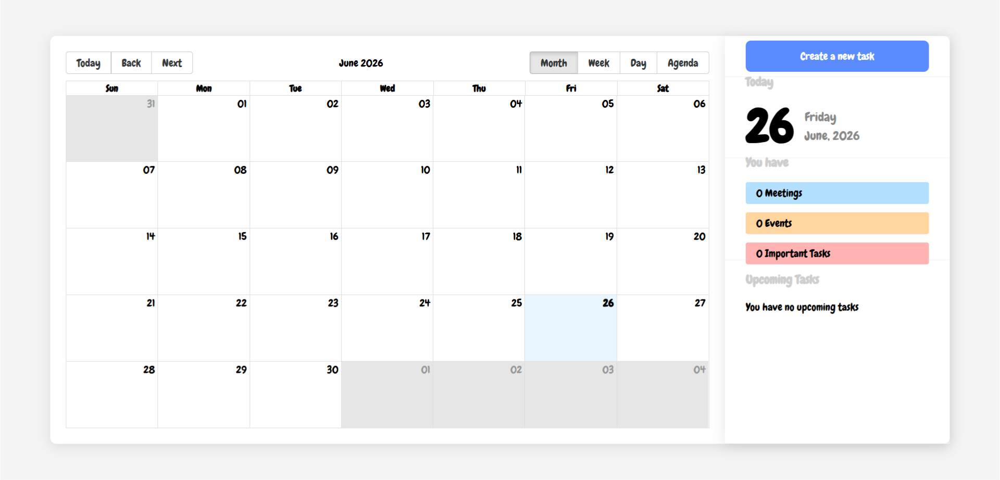

# Task Manager App

A modern calendar-based Task Manager application built with **React** and **Vite**. The app allows users to create, edit, delete, complete, categorize, and track tasks through a clean calendar interface with a right-side details panel.

This project was built as part of the Udemy course **React : The Complete Beginner Course - Build A Task Manager**.

---

## Live Demo

You can view the live version of the project here:

[Task Manager App Live Demo](https://mo7ammedzaino.github.io/task-manager-app/)

---

## Course Information

- **Course Name:** React : The Complete Beginner Course - Build A Task Manager
- **Course Link:** https://www.udemy.com/course/react-the-complete-beginner-course-build-a-task-manager/
- **Instructor:** Ebuka Beluolisa
- **Student Name:** Moahmmed Zaino
- **Project Type:** Educational React project / Practical training project

---

## Project Overview

The Task Manager App is a frontend web application that helps users manage their daily tasks using a calendar view. Users can schedule tasks with a date, start time, end time, description, and category. The application also includes a task summary section, upcoming task list, task completion status, browser notifications, and sound reminders.

The project focuses on applying React fundamentals in a real application, including components, props, state, forms, conditional rendering, lists, event handling, `useEffect`, and third-party library integration.

---

## Screenshot

The application interface contains two main sections:

1. A large calendar area for viewing tasks by month, week, day, or agenda.
2. A right-side details panel for creating tasks, viewing today's date, tracking task counts, and showing upcoming tasks.



---

## Features

### Task Management

- Create new tasks.
- Edit existing tasks.
- Delete tasks.
- Mark tasks as completed or uncompleted.
- Store task title, description, date, start time, end time, and category.

### Calendar View

- Display tasks inside a calendar.
- Support multiple calendar views:
  - Month
  - Week
  - Day
  - Agenda
- Navigate between dates using calendar controls.
- Open task details by clicking on a calendar event.

### Task Categories

Tasks can be categorized into three types:

- **Event**
- **Meeting**
- **Important**

Each category has its own color and icon to make tasks easier to identify visually.

### Task Tracker

The right-side panel displays a live count of incomplete tasks by category:

- Meetings
- Events
- Important Tasks

Completed tasks are not included in these counters.

### Upcoming Tasks

The application displays upcoming tasks sorted by date and start time. Completed tasks and old tasks are excluded from the upcoming task list.

### Browser Notifications

The app uses the Browser Notification API to notify the user shortly before a task starts.

Notification behavior:

- The app requests notification permission from the browser.
- It checks upcoming tasks every minute.
- If a task starts in about 4 to 5 minutes, the app displays a notification.
- A sound alert is played using the `notification.wav` file.
- Completed tasks do not trigger notifications.

---

## Tech Stack

| Technology               | Purpose                           |
| ------------------------ | --------------------------------- |
| React                    | Building the user interface       |
| Vite                     | Development server and build tool |
| JavaScript / JSX         | Main programming language         |
| SCSS / Sass              | Styling the application           |
| react-big-calendar       | Rendering the calendar UI         |
| moment                   | Date and time formatting          |
| react-icons              | Displaying task and action icons  |
| uuid                     | Generating unique task IDs        |
| Browser Notification API | Showing task reminders            |
| HTML Audio API           | Playing notification sounds       |
| ESLint                   | Code linting and quality checks   |

---

## Main Dependencies

```json
{
  "react": "^19.2.0",
  "react-dom": "^19.2.0",
  "vite": "^7.2.4",
  "react-big-calendar": "^1.19.4",
  "moment": "^2.30.1",
  "react-icons": "^5.5.0",
  "uuid": "^13.0.0",
  "sass-embedded": "^1.97.3"
}
```

---

## Project Structure

```txt
task-manager-app/
├── public/
│   ├── logo.png
│   └── notification.wav
│
├── src/
│   ├── components/
│   │   ├── createANewTask/
│   │   │   ├── CreateANewTask.jsx
│   │   │   └── CreateANewTask.scss
│   │   │
│   │   ├── dateDisplay/
│   │   │   ├── DateDisplay.jsx
│   │   │   └── DateDisplay.scss
│   │   │
│   │   ├── details/
│   │   │   ├── Details.jsx
│   │   │   └── Details.scss
│   │   │
│   │   ├── eventCalendar/
│   │   │   ├── EventCalendar.jsx
│   │   │   └── EventCalendar.scss
│   │   │
│   │   ├── modal/
│   │   │   ├── Modal.jsx
│   │   │   └── Modal.scss
│   │   │
│   │   ├── TaskTracker/
│   │   │   ├── TaskTracker.jsx
│   │   │   └── TaskTracker.scss
│   │   │
│   │   └── UpcomingTasks/
│   │       ├── UpcomingTasks.jsx
│   │       └── UpcomingTasks.scss
│   │
│   ├── utils/
│   │   ├── utils.js
│   │   └── utils.components.jsx
│   │
│   ├── App.jsx
│   ├── App.scss
│   ├── index.css
│   └── main.jsx
│
├── .gitignore
├── eslint.config.js
├── index.html
├── package.json
├── package-lock.json
├── vite.config.js
└── README.md
```

---

## Installation

### 1. Clone the repository

```bash
git clone <repository-url>
```

### 2. Navigate to the project folder

```bash
cd task-manager-app
```

### 3. Install dependencies

```bash
npm install
```

### 4. Run the development server

```bash
npm run dev
```

### 5. Open the app in the browser

The app usually runs on:

```txt
http://localhost:5173
```

---

## Available Scripts

### Run development server

```bash
npm run dev
```

Starts the Vite development server.

### Build for production

```bash
npm run build
```

Creates an optimized production build.

### Preview production build

```bash
npm run preview
```

Runs a local preview of the production build.

### Run ESLint

```bash
npm run lint
```

Checks the project files for linting issues.

---

## How the Application Works

### 1. Application State

The main task data is stored in React state inside `App.jsx`:

```jsx
const [tasks, setTasks] = useState([]);
const [taskToEdit, setTaskToEdit] = useState(null);
```

- `tasks` stores all created tasks.
- `setTasks` is used to create, update, delete, and complete tasks.
- `taskToEdit` stores the currently selected task when the user wants to edit it.

Because the app uses React state only, tasks are not saved permanently after refreshing the page.

---

### 2. Creating a Task

The `CreateANewTask` component contains the task form. It collects:

- Task name
- Task description
- Date
- Start time
- End time
- Category/tag

When a new task is created, the app generates a unique ID using `uuid`:

```jsx
id: uuidv4();
```

Then the new task is added to the `tasks` state.

---

### 3. Editing a Task

When the user clicks the edit button inside the task modal, the selected task is stored in `taskToEdit`. The task form then opens with the old task values already filled in.

When the user saves the form, the app updates the matching task by comparing task IDs.

---

### 4. Deleting a Task

Tasks can be deleted from the modal. The application removes the selected task by filtering it out of the `tasks` array.

---

### 5. Completing a Task

The user can mark a task as completed or uncompleted from the modal. Completed tasks are shown with a line-through style in the calendar and are excluded from the task tracker counters and notification reminders.

---

### 6. Displaying Tasks in the Calendar

The calendar is handled by the `EventCalendar` component using `react-big-calendar`.

Before passing tasks to the calendar, the app converts the task date and time values into JavaScript `Date` objects:

```jsx
start: new Date(`${event.date}T${event.start}:00`),
end: new Date(`${event.date}T${event.end}:00`)
```

This allows `react-big-calendar` to display each task in the correct date and time slot.

---

## Task Data Structure

Each task follows this general structure:

```js
{
  id: "unique-task-id",
  title: "Task title",
  description: "Task description",
  date: "2026-06-26",
  start: "10:00",
  end: "11:00",
  tag: {
    name: "Meeting",
    color: "#33A8FF",
    id: "meeting",
    lightColor: "#B3E0FF",
    lighterColor: "#eaf6ff"
  },
  isCompleted: false
}
```

---

## Main Components

### `App.jsx`

The root component of the application. It manages the main task state, passes data to child components, and handles browser notifications.

### `EventCalendar.jsx`

Displays the calendar using `react-big-calendar`. It handles calendar navigation, calendar views, event styling, and opening the task modal.

### `Details.jsx`

Controls the right-side panel. It switches between the task creation/editing form and the normal details view.

### `CreateANewTask.jsx`

Contains the form used to create and edit tasks.

### `DateDisplay.jsx`

Displays the current day, weekday, month, and year.

### `TaskTracker.jsx`

Counts incomplete tasks by category and displays them in the details panel.

### `UpcomingTasks.jsx`

Filters and sorts upcoming tasks, then displays them in the right-side panel.

### `Modal.jsx`

Displays task details after the user clicks a calendar event. It also provides buttons for completing, editing, and deleting a task.

### `utils.js`

Contains reusable logic and data, including task tags, time formatting, upcoming task sorting, and test data.

### `utils.components.jsx`

Contains reusable icon-rendering logic for task categories.

---

## Notification System

The notification system is implemented in `App.jsx` using `useEffect`.

The app checks for upcoming tasks every 60 seconds:

```jsx
const interval = setInterval(checkUpcomingTasks, 60000);
```

If a task starts within the next 4 to 5 minutes, the app:

1. Plays the notification sound from `public/notification.wav`.
2. Shows a browser notification with the task title.
3. Uses the task ID as the notification tag to reduce duplicate notifications.

Important notes:

- Notifications require browser permission.
- Notifications work only while the app is open in the browser.
- Some browsers may block audio until the user interacts with the page.

---

## Styling

The project uses SCSS files for styling. Each main component has its own SCSS file, which keeps the styling organized and easier to maintain.

The app also imports styles from `react-big-calendar`:

```scss
@import "react-big-calendar/lib/sass/styles";
@import "react-big-calendar/lib/addons/dragAndDrop/styles";
```

---

## Learning Outcomes

By building this project, the following React concepts were practiced:

- React project setup with Vite.
- Component-based architecture.
- JSX syntax.
- Props and prop drilling.
- State management with `useState`.
- Side effects with `useEffect`.
- Controlled form inputs.
- Conditional rendering.
- Rendering lists with `.map()`.
- Updating arrays in state.
- Passing functions between components.
- Integrating third-party libraries.
- Using browser APIs inside React.
- Styling React components with SCSS.

---

## Current Limitations

This project is a frontend educational project, so it has some limitations:

- No backend server.
- No database.
- No user authentication.
- Tasks are not saved after page refresh.
- Notifications only work while the browser tab is open.
- Notification permission must be approved by the user.
- No validation to prevent the end time from being earlier than the start time.
- No advanced recurring tasks feature.
- The interface is mainly designed for larger screens and may need more work for mobile responsiveness.

---

## Future Improvements

Possible improvements for future versions:

- Save tasks in `localStorage`.
- Add a backend API.
- Connect the app to a database.
- Add user login and authentication.
- Add task search and filtering.
- Add task priority levels.
- Add recurring tasks.
- Add drag-and-drop task rescheduling.
- Add better form validation.
- Improve responsive design for mobile devices.
- Add dark mode.
- Add deployment to Vercel or Netlify.

---

## Educational Purpose

This project was completed for learning and practical training purposes while studying React. It demonstrates how React components, state, props, events, forms, effects, and external libraries can work together to build a real interactive web application.

---

## Student

**Moahmmed Zaino**

Built as part of the Udemy course:

**React : The Complete Beginner Course - Build A Task Manager**  
Instructor: **Ebuka Beluolisa**
